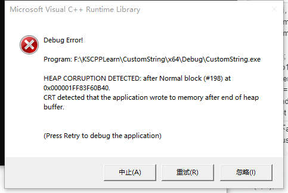

<!--
 * @Author: your name
 * @Date: 2022-02-13 22:01:55
 * @LastEditTime: 2022-02-13 22:09:07
 * @LastEditors: Please set LastEditors
 * @FilePath: \undefinede:\KSCPPLearn\CustomString\README.md
-->
# CustomString

自定义String类型

```cpp
#pragma once
#include "vector"
#include <iostream>

class CustomString
{
public:
	CustomString(const char* _str = nullptr);	// 默认构造
	CustomString(const CustomString& _other);	// 拷贝构造
	CustomString& operator =(const CustomString& _other);

	inline bool operator == (const CustomString& _other);   
	
	friend std::ostream& operator<<(std::ostream& os, const CustomString& str) // 友元
	{
		os << str.m_data ;
		return os;
	}

	~CustomString();

	void append(const char* _other);
	void append(const CustomString& _other);
	
	int len();

	CustomString sub(int startIndex = 0, int endIndex = -1);

	std::vector<CustomString> split(const char* _key);

	int find(const char* _target);
protected:
	void setValueByOtherCustomString(const char* _other);
	
private:
	char* m_data{nullptr};						// 数据实际存放位置
};
```

| 函数名      | 功能                             |
| ----------- | -------------------------------- |
| append      | 将指定字符添加到字符末尾         |
| len         | 字符串长度                       |
| sub         | 从startIndex到endIndex切割字符串 |
| find        | 找到指定字符串的位置             |
| operator << | 重载输出操作符                   |
| operator == | 重载==操作符                     |
| opeartor =  | 赋值操作                         |
| split       | 切割字符串                       |

## append

new出一个新的内存空间，将原本内容和新内容复制到新内存空间中  

```cpp
void CustomString::append(const char* _other)
{
	int targetLen = strlen(m_data) + strlen(_other) + 1;
	char* newData = new char[targetLen];
	memset(newData, '\0', targetLen);
	strcpy(newData, m_data);
	strcat(newData, _other);
	delete[] m_data;
	m_data = newData;
}
```



HEAP CORRUPTION DETECTED : after Normal block的问题，一般发生在`delete[]`语句，原因是删除的内存空间与最开始申请内存空间长度不同，即代码在运行的时候存在数组越界的情况

```cpp
void CustomString::append(const char* _other)
{
	strcat(m_data, _other);
}
```

上述代码会直接触发错误，原因是m_data后面添加了新的内容，但是m_data的内存长度还是原本的内存长度，导致结果就m_data发生越界  

## find

最开始准备直接双重循环暴力查找，后面还是选择使用KMP保护性能  

```cpp
int CustomString::KMP(const char* source, const char* pattern, int findStartIndex) {
	int result = -1;
	int sourceLen = strlen(source);
	int patternLen = strlen(pattern);

	int* patternNext = new int[patternLen];

	CreateNext(pattern, patternNext);

	// source 使用 sIndex 定位
	// pattern 使用 pIndex 定位
	int sIndex = findStartIndex, pIndex = 0;
	while (sIndex < sourceLen)
	{
		if (pIndex == patternLen - 1 && pattern[pIndex] == source[sIndex])	// 表示找到 返回序号
		{
			result = sIndex - patternLen + 1;								// 手动算一下就知道为什么+1  从0开始的序号，当前在第4位找到，模式串长度为2,4-2+1才是开始位置
			break;
		}
		if (source[sIndex] == pattern[pIndex]) {
			++sIndex, ++pIndex;
		}
		else {
			pIndex = patternNext[pIndex];
			if (pIndex == -1)												// 表示从最开始就不匹配，所以直接跳过
			{
				++pIndex, ++sIndex;
			}
		}
	}

	delete[] patternNext;
	return result;
}

void CustomString::CreateNext(const char* P, int* next)
{
	int q, k;							//q:模版字符串下标；k:最大前后缀长度
	int m = strlen(P);					//模版字符串长度
	memset(next, 0, m);
	next[0] = 0;						//模版字符串的第一个字符的最大前后缀长度为0
	for (q = 1, k = 0; q < m; ++q)		//for循环，从第二个字符开始，依次计算每一个字符对应的next值
	{
		while (k > 0 && P[q] != P[k])	//递归的求出P[0]···P[q]的最大的相同的前后缀长度k
		{
			k = next[k - 1];			//不理解没关系看下面的分析，这个while循环是整段代码的精髓所在，确实不好理解  
		}
		if (P[q] == P[k])				//如果相等，那么最大相同前后缀长度加1
		{
			k++;
		}
		next[q] = k;
	}
	MoveNextArr(next, strlen(P));		// 为了方便KMP算法将数组往后移动一个位，并将第一位补齐为-1
}
```

KMP算法的核心就是next数组的创建

next数组表示的含义是，当前长度的字符串中，最长前缀后缀相等的字符串，这里最长不能肯定不能是字符串本身  

比如：“aaaa”的最长前缀就是\[0~2\]“aaa”，最长后缀就是\[1~3\]“aaa”  

|index => |A|B|A|B|C|A|B|A|A|
|--- |--- |--- |--- |--- |--- |--- |--- |--- |--- |
|1 => |0|||||||||
|2 => |0|0||||||||
|3 => |0|0|1|||||||
|4 => |0|0|1|2||||||
|5 => |0|0|1|2|0|||||
|6 => |0|0|1|2|0|1||||
|7 => |0|0|1|2|0|1|2|||
|8 => |0|0|1|2|0|1|2|3||
|9 => |0|0|1|2|0|1|2|3|1|

上述表格可以看到next依次求出的顺序  

1. 比如第四步，index等于3的字母‘B’，它前面(index=2)的最长相等的前后缀长度是1，可知第2位和第0位字符相同，只需要判断第1位与当前第3位的‘B’**是否相等**，如果相等，那么字符串中0~1和2~3就相等，那么则0~3的最长相等前后缀长度为2  
2. 通过上面可知，第八步同理，index等于7的字母‘A’，它前面(index=6)的最长相等前后缀长度是2，可知字符串0~1和字符串5~6相等，则如果第2位和当前的第7位相等，可立即推出，字符串0~7的最长相等前后缀就是2(0~6的最长相等)+1(当前位)

> KMP的Next数组思维就是通过已知(已经遍历)的内容，来节省遍历的次数  

3. 第9步，0~7的最长相等前后缀的长度是3，但是第8位不等于第3位，所以我们继续往前查找，第2位的next的值为1，第1位'B'不等于第8位，继续往前找，第0位的next值为0，且'A'等于第8位的值，那么next\[8\] = next\[0\] + 1


当我们查询到P和T的第3位时，发现并不相同，此时并不需要完全从头开始匹配，而是将P的查询指针移动到第1位（刚好就是其next数组值对应的位置），可以节省一些比较次数  

## Split

切割字符串，将find和sub结合在一起  
通过find查找目标模式串的位置，再通过sub将目标模式串前的值切割出来  