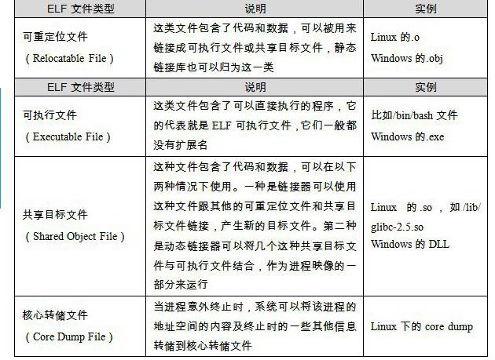
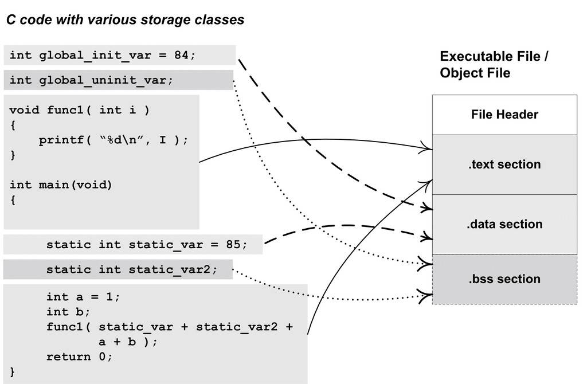

# 程序员的自我修养

## 编译和链接

### 一般过程

```cpp
#include <stdio.h>

int main()
{
    printf("Hello World\n");
    return 0;
}
```

- 程序为什么要被编译器编译了之后才可以运行？
- 编译器在把C语言程序转换成可以执行的机器码的过程中做了什么，怎么做的？
- 最后编译出来的可执行文件里面是什么？除了机器码还有什么？它们怎么存放的，怎么组织的？
- `#include <stdio.h>`是什么意思？把stdio.h包含进来意味着什么？C语言库又是什么？它怎么实现的？
- 不同的编译器（Microsoft VC、GCC）和不同的硬件平台（x86、SPARC、MIPS、ARM），以及不同的操作系统（Windows、Linux、UNIX、Solaris），最终编译出来的结果一样吗？为什么？
- Hello World程序是怎么运行起来的？操作系统是怎么装载它的？它从哪儿开始执行，到哪儿结束？main函数之前发生了什么？main函数结束以后又发生了什么？
- 如果没有操作系统，Hello World可以运行吗？如果要在一台没有操作系统的机器上运行Hello World需要什么？应该怎么实现？
- printf是怎么实现的？它为什么可以有不定数量的参数？为什么它能够在终端上输出字符串？
- Hello World程序在运行时，它在内存中是什么样子的？


1. 预编译：源代码文件(main.c)和相关头文件(stdio.h)预编译成一个.i文件
    - 命令行：`gcc -E main.c -o main.i`
    - 主要处理那些源代码文件中的以`#`开始的预编译指令(`#include`,`#define`等)
      - 删除所有的`#define`，并且展开所有的宏定义
      - 处理所有条件预编译指令`#if`、`#ifdef`、`#elif`、`#else`、`#endif`等
      - 处理`#include`预编译指令，将被包含的文件插入到该预编译指令的位置。该过程是递归进行的，也就是说被包含的文件可能还包含其他文件
      - 删除所有的注释`//`和`/**/`
      - 添加**行号**和**文件名标识**，比如`#2`(第二行)，`main.o`(文件名)，以便于编译时编译器产生**调试用的行号信息**以及编译时产生编译错误的**警告时能够显示行号**
      - 保留所有的的`#pragma`编译器指令，因为编译器需要使用使用到

经过预编译之后的`.i`文件不包含任何宏定义，因为所有的宏已经被展开，并且包含的文件也已经被插入到`.i`文件中。所以当无法判断宏定义是否正确或者头文件是否正确时，可以查看与编译后的文件来确定文件  

2. 编译：把预处理完的文件进行一系列的**词法分析**、**语法分析**、**语义分析**及**优化**后生产相应的汇编代码文件
    - 这个过程往往是我们所说的整个程序构建的核心部分，也是最复杂的部分之一
    - 命令行：`gcc -S main.i -o main.s`
    - 通过命令行可以得到汇编输出文件hello.s

3. 汇编：汇编器是将代码转变成机器可以执行的指令，每一个汇编语句几乎都对应一条机器指令
    - 汇编器的汇编或称相对于编译器来讲比较简单，没有复杂的语法也米有语义，也不需要做指令优化，只是根据汇编指令和机器指令的对照表——翻译就可以了
    - 命令行：`as main.s -o hello.o`，调用汇编器as完成
    - 命令行：`gcc -c main.c -o main.o`，调用gcc直接从C源代码经过预编译、编译和汇编直接生成目标文件(Object File)

4. 链接：为什么需要链接？为什么汇编器不能直接输出可执行文件而是输出目标文件？

### 编译器做了什么


编译过程分成六步：**扫描**->**语法分析**->**语义分析**->**源代码优化**->**目标代码生成**->**代码优化**

```cpp
array[index] = (index + 4) * (2 + 6)
```

1. 词法分析

源代码程序被输入到扫描器(Scanner)，进行简单的词法分析，运用一种类似有限状态机(Finite State Machine)的算法可以轻松地将源代码分割成一系列的记号(Token)  

比如上述代码存在28个非空字符，经过扫描后生成16个记号

| 记号 | 类型 |
| --- | --- |
| array | 标识符 |
| [ | 左方括号 |
| index | 标识符 |
| ] | 右方括号 |
| = | 赋值 |
| ( | 左原名括号 |
| index | 标识符 |
| + | 加号 |
| 4 | 数字 |
| ) | 右圆括号 |
| * | 乘号 |
| ( | 左圆括号 |
| 2 | 数字 |
| + | 加号 |
| 6 | 数字 |
| ) | 右圆括号 |

- 词法分析一般可以分为如下几类
  - 关键字
  - 标识符
  - 字面量（数字、字符串等）
  - 特使符号（加号、等号等）

在识别记号的同时，扫描器也完成了其他工作。比如将标识符存在**符号表**，将数字、字符串常量存放到**文字表**等，以备后面的步骤使用  

> 有一个叫做lex的程序可以实现词法扫描，它会按照用户之前描述好的词法规则将输入的字符串分割成一个个记号

tip. 对于一些有预处理的语言（C语言等），它的宏替换和文件包含等工作一般不归入编译器的范围而交给一个独立的预处理器

------


2. 语法分析

语法分析器(Grammar Parser)将对由扫描器产生的记号进行语法分析，从而产生语法树(Syntax Tree)  
整个过程采用了上下文无关语法(Context-tree Grammar)的分析手段：由词法分析器生成的语法树就是以表达式(Expression)为节点的书


> 上述代码语法树

- 数字和符号是最小的表达式，他们不是由其他的表达式来组成的，所以他们通常作为整个语法树的叶节点
- 确定大部分运算符号的优先级和含义
  - 部分符号具有多重含义：比如`*`可以表示乘法，也可以表示取指针的值

语法分析阶段必须对上述内容进行区分，如果出现了表达式不合法：比如括号比匹配、表达式缺少操作符等，编译器就会报告语法分析阶段的错误  

> 语法分析也有一个现成的工具叫做yacc（Yet Another Compiler Compiler）可以根据用户给定的语法规则对输入的记号序列进行解析，从而构建出一棵语法树  
> 对于不同的编程语言，编译器的开发者只须改变语法规则，而无须为每个编译器编写一个语法分析器，所以它又被称为"编译器编译器(Compiler Compiler)"

3. 语义分析

语义分析交给语义分析器来完成  

语法分析仅仅是完成了对表达式的语法层面的分析，但是它并不了解整个语句是否真正有意义（比如指针相乘是没有意义的大那是可以过语法分析）

编译器能分析的语义是静态语义

- 静态语义：编译器可以确定的语义
  - 通常包括声明的和类型的匹配，类型的转换
- 动态语义：运行期才能确定的语义
  - 运行期出现的语义相关的问题，比如除0错误


图中每个表达式（包括符号和数字）都被表示了类型，语义分析还对符号表里的符号类型也做了更新

-----

4. 中间语言生成

现代编译器有很多层次的优化，往往在源代码级别会有一个优化过程，就是源码级优化器(Source Code Optimizer)，在不同的编译器中可能会有不同的定义或者一些其他的差异

源码级优化器会在源代码级别上进行优化，比如上述代码`(2 + 6)`可以直接确定为`8`

当然还有一些其他复杂的优化


直接在语法树上做优化比较困难，所以源代码优化器往往将整个语法树转换成中间代码(Intermediate Code)，他是语法树的顺序表示，其实他已经非常接近目标代码。但是它一般跟目标机器和运行时环境是无关的，比如它不包括数据的尺寸、变量地址、寄存器名称等  

中间代码有很多类型，不同的编译器中有着不同的形式，比较常见的有：**三地址码**(Three-address Code)和**P-代码**(P-Code)

```cpp
t1 = 2 + 6
t2 = index + 4
t3 = t1 * t2
array[index] = t3
```

上述式子是将`array[index] = (index + 4) * (2 + 6)`转换成三地址码的形式，利用t1、t2、t3这几个临时变量，并在此基础上进行优化，直接得出`t1 = 8`进行将t1替换成8，省去一个临时变量

```cpp
t1 = index + 4
t2 = t1 * 8
array[index] = t2
```

中间代码是的编译器可以被分为前端和后端。编译器**前端负责产生机器无关的中间代码**，编译器**后端将中间代码转换成目标机器代码**。这样对于一些可以跨平台的编译器而言，他们可以针对不同的平台使用同一个前端和针对不同的机器平台的数个后端

-----

5. 目标代码的生成与优化

源代码级优化器产生中间代码标志着下面的过程都属于编辑器后端。编译器后端主要包括**代码生成器(Code Generator)**和**目标代码优化器(Target Code Optimizer)**

- 代码生成器：将中间代码转换成目标机器代码，这个过程十分依赖于目标机器，因为不同的机器有着不同的字长、寄存器、整数数据类型和浮点数数据类型等

```
movl index, %ecx        ; value of index to ecx
addl $4, %ecx           ; ecx = ecx + 4
mull $8, %ecx             ; ecx = ecx * 8
movl index, %eax        ; value of index to eax
movl %ecx, array(,eax,4)  ; array[index] = ecx
```

- 目标代码优化器：对上述的目标代码进行优化，比如：寻找合适的寻址方式、使用位移来替代乘法运算、删除多余的指令等
  - 针对上述代码，乘法由一条相对复杂的基址比例变址寻址(Base Index Scale Addressing)的lea指令完成，随后由一条mov指令完成最后的赋值操作，这条mov指令的寻址方式和lea是一样的

```
movl  index, %edx
leal  32(,%edx,8), %eax
movl  %eax, array(,%edx,4)
```

如果`index`和`array`定义在跟上面的源代码同一个编译单元里面，那么编译器可以为index和array分配空间，确定他们的地址。但是如果定义在**其他模块**怎么处理？

定义在**其他模块的全局变量和函数**在最终运行时的绝对地址都要在最终链接的时候才能确定。所以现代编译器可以将一个源代码文件编译成一个未链接的目标文件，然后由链接器最终将这些目标文件链接起来形成可执行文件
### 模块拼接——静态链接

把每个源代码模块独立地编译，然后按照需要将它们**组装**起来，这个组装模块的过程就是**链接**

链接的主要内容就是把各个模块之间相互引用的部分都处理好，使得各个模块之间能够正确地衔接。因为现代的高级语言的诸多特性和功能，使得编译器、链接器更加复杂，功能更为强大，但是就本质而言其无非就是**把一些指令对其他符号地址的引用加以修正**

链接的过程主要包括了**地址和空间分配(Address and Storage Allocation)**、**符号决议(Symbol Resolution)**和**重定位(Relocation)**等步骤

- 符号决议：也称符号绑定(Symbol Binding)、名称绑定(Name Binding)、名称决议(Name Resolution)，设置可以叫地址绑定(Address Binding)、指令绑定(Instruciton Binding)等
  - 大体意思上都一样，但从细节角度来区分，还是有一定区别："决议"趋向静态链接，"绑定"倾向动态链接，即使用范围不同


最基本的**静态链接过程**如图所示，每个模块的源代码文件经过编译器编译成目标文件(Object File，**一般后缀名为.o**)，目标文件和库(Library)一起链接，最终形成**可执行文件**

例如在a.c模块中调用b.c模块的foo方法，因为是两种不同的模块，所以是**分开编译**的，此时a.c并不知道b.c中的foo方法的地址，只能先把foo地址暂时搁置，等待最后链接的时候由**链接器**去将这些指令地址修正

> 其实程序员手动更改也行，但是不仅复杂，而且每次编译后的地址可能都不一样，那么需要每次编译都要手动修改  

最常见的库就是运行时库(Runtime Library)，它是支持程序运行的基本函数的集合。库其实是一组目标文件的包，就是一些最常用的代码编译成目标文件后打包存放

> 一般称Object Fiile文件目标文件，很多时候也把目标文件称为模块  

## 目标文

目标文件从结构上将，它是已经编译后的可执行文件，但是还没有经过链接的过程，其中可能有些符号或有些地址还没有被调整。其实他本身就是按照可执行文件格式存储的，只是跟真正的可执行文件在结构上稍有不同  

### 目标文件的格式

目标文件就是源代码编译后但未连接的中间文件(Windows下的.obj和Linux下的.o)，与可执行文件的内容结构相似，



> 现在PC平台流行的可执行文件格式（Executable）主要是Windows下的PE（Portable Executable）和Linux的ELF（Executable Linkable Format），它们都是COFF（Common file format）格式的变种

**动态链接库**和**静态链接库**文件都按照可执行文件格式存储

> 静态链接库稍有不同，它是很多目标文件捆绑在一起形成一个文件，再加上一些索引。可以理解为**包含很多目标文件的文件包**

目标文件与可执行文件格式跟操作系统和编译器密切相关，所以不同的系统平台下会有不同的格式，但这些格式又大同小异，目标文件格式与可执行文件格式的历史几乎是操作系统的发展史

### 目标文件是什么样

目标文件中的内容：编译后的机器码、数据、链接时所需要的一些信息（符号表、调试信息、字符串等）  

一般目标文件将这些信息按不同的属性，以“节(Section)”的形式存储，有时候也叫“段(Segment)”

- 程序源代码编译后的字节指令经常放在代码段(`Code Section`)中，代码段常见的名字有`.code`或者`.text`  
- 全局变量和局部静态变量数据经常放在数据段(`Data Section`)，数据段一般名字都叫`.data`



ELF文件的开头是一个`文件头`：描述了文件的文件属性、是否可执行、是静态链接还是动态链接以及入口地址(如果是可执行文件)、目标硬件、目标操作系统等信息，还包括一个`段表`(Section Table)，段表是一个描述文件中各个段的数组

段表描述了文件中各个段在文件中的偏移位置及段的属性等，从段表中可以得到每个段的所有信息

文件头后就是各个段的内容

| 段 | 作用 |
| --- | --- |
| .text | C语言编译后执行语句都编译成机器代码 |
| .bss | 未初始化全局变量和局部静态变量 |
| .data | 数据段属于静态内存分配，所有有初值的全局变量和用static修饰的静态变量，常量数据都在数据段中|


- 总的来说：程序源代码被编译后主要分程两种段：**程序指令**和**程序数据**
  - **代码段**属于**程序指令**
  - **数据段和.bss段**属于**程序数据**
  - 为什么要分成两块
    - 程序被装载之后，数据和指令分别被映射到两个虚存空间。数据区域对进程来说可读写，指令区域对进程来说只读。防止程序的指令被有意或无意的改写
    - 对于CPU来说，CPU有很强的**缓存**体系，程序必须尽量**提高缓存的命中率**。指令区和数据区的分离有利于提高程序的**局部性**
    - 可能运行多个该程序的副本，他们的指令是相同的，仅仅是数据不同，所以只需要保存一份指令区代码(**共享指令**可以节省大量的内存，尤其是配合动态链接使用时)

### 挖掘目标文件

```cpp
int printf( const char* format, ... );

int global_init_var = 84;
int global_uninit_var;

void func1( int i ) 
{
  printf( "%d\n",  i );
}

int main(void)
{
    static int static_var = 85;
 static int static_var2;

    int a = 1;
    int b; 

    func1( static_var + static_var2 + a + b );

    return a; 
}
```

上述代码通过`gcc -c main.c`只编译不链接得到目标文件`main.o`，再通过`objdump -h main.o`来查看目标文件内部结构

```
main.o:     file format elf64-x86-64

Sections:
Idx Name          Size      VMA               LMA               File off  Algn
  0 .text         00000057  0000000000000000  0000000000000000  00000040  2**0
                  CONTENTS, ALLOC, LOAD, RELOC, READONLY, CODE
  1 .data         00000008  0000000000000000  0000000000000000  00000098  2**2
                  CONTENTS, ALLOC, LOAD, DATA
  2 .bss          00000004  0000000000000000  0000000000000000  000000a0  2**2
                  ALLOC
  3 .rodata       00000004  0000000000000000  0000000000000000  000000a0  2**0
                  CONTENTS, ALLOC, LOAD, READONLY, DATA
  4 .comment      0000002a  0000000000000000  0000000000000000  000000a4  2**0
                  CONTENTS, READONLY
  5 .note.GNU-stack 00000000  0000000000000000  0000000000000000  000000ce  2**0
                  CONTENTS, READONLY
  6 .eh_frame     00000058  0000000000000000  0000000000000000  000000d0  2**3
                  CONTENTS, ALLOC, LOAD, RELOC, READONLY, DATA
```

> 每个段的第一行的数据分别对应Size、VMA、LMA、FileOFF、Algn，第二行对应段的属性

| 段 | 名称 |
| --- | --- |
| .text | C语言编译后执行语句都编译成机器代码 |
| .data | 数据段属于静态内存分配，所有有初值的全局变量和用static修饰的静态变量，常量数据都在数据段中 |
| .bss | 未初始化全局变量和局部静态变量 |
| .rodata | 只读数据段 |
| .comment | 注释信息段 |
| .note.GNU-stack | 堆栈提示段 |

| 属性 | 含义 |
| --- |--- |
| Size | 段的长度 |
| File Off | 段所在的位置 |
| CONTENS | 表示该段在文件中存在 |
| 。。。 | 。。。 |

> 上表可见.bss段第二行属性列中没有CONTENTS属性，表示.bss其实在文件中不占空间  
> 对应见.data段，有`CONTENTS, ALLOC, LOAD, DATA`四种属性  

因为.bss段没有`CONTENTS`，而.note.GNU-stack段的`Size`是0，所以暂且忽略这两个段


通过`size main.o`查看目标文件中各个部分的长度

```
root@cong:~/Cpp# size main.o
   text    data     bss     dec     hex filename
    179       8       4     191      bf main.o
```

> dec表示3个段长度的和的十进制，hex表示三个段的和的十六进制

使用`objdump`的`-s`命令查看所有段的内容

`objdump -s -d main.o`

```bash
main.o:     file format elf64-x86-64

Contents of section .text:
 0000 554889e5 4883ec10 897dfc8b 45fc89c6  UH..H....}..E...
 0010 488d3d00 000000b8 00000000 e8000000  H.=.............
 0020 0090c9c3 554889e5 4883ec10 c745f801  ....UH..H....E..
 0030 0000008b 15000000 008b0500 00000001  ................
 0040 c28b45f8 01c28b45 fc01d089 c7e80000  ..E....E........
 0050 00008b45 f8c9c3                      ...E...
Contents of section .data:
 0000 54000000 55000000                    T...U...
Contents of section .rodata:
 0000 25640a00                             %d..
Contents of section .comment:
 0000 00474343 3a202855 62756e74 7520372e  .GCC: (Ubuntu 7.
 0010 352e302d 33756275 6e747531 7e31382e  5.0-3ubuntu1~18.
 0020 30342920 372e352e 3000               04) 7.5.0.
Contents of section .eh_frame:
 0000 14000000 00000000 017a5200 01781001  .........zR..x..
 0010 1b0c0708 90010000 1c000000 1c000000  ................
 0020 00000000 24000000 00410e10 8602430d  ....$....A....C.
 0030 065f0c07 08000000 1c000000 3c000000  ._..........<...
 0040 00000000 33000000 00410e10 8602430d  ....3....A....C.
 0050 066e0c07 08000000                    .n......

# 下面是反汇编的结果

Disassembly of section .text:

0000000000000000 <func1>:
   0:   55                      push   %rbp
   1:   48 89 e5                mov    %rsp,%rbp
   4:   48 83 ec 10             sub    $0x10,%rsp
   8:   89 7d fc                mov    %edi,-0x4(%rbp)
   b:   8b 45 fc                mov    -0x4(%rbp),%eax
   e:   89 c6                   mov    %eax,%esi
  10:   48 8d 3d 00 00 00 00    lea    0x0(%rip),%rdi        # 17 <func1+0x17>
  17:   b8 00 00 00 00          mov    $0x0,%eax
  1c:   e8 00 00 00 00          callq  21 <func1+0x21>
  21:   90                      nop
  22:   c9                      leaveq
  23:   c3                      retq

0000000000000024 <main>:
  24:   55                      push   %rbp
  25:   48 89 e5                mov    %rsp,%rbp
  28:   48 83 ec 10             sub    $0x10,%rsp
  2c:   c7 45 f8 01 00 00 00    movl   $0x1,-0x8(%rbp)
  33:   8b 15 00 00 00 00       mov    0x0(%rip),%edx        # 39 <main+0x15>
  39:   8b 05 00 00 00 00       mov    0x0(%rip),%eax        # 3f <main+0x1b>
  3f:   01 c2                   add    %eax,%edx
  41:   8b 45 f8                mov    -0x8(%rbp),%eax
  44:   01 c2                   add    %eax,%edx
  46:   8b 45 fc                mov    -0x4(%rbp),%eax
  49:   01 d0                   add    %edx,%eax
  4b:   89 c7                   mov    %eax,%edi
  4d:   e8 00 00 00 00          callq  52 <main+0x2e>
  52:   8b 45 f8                mov    -0x8(%rbp),%eax
  55:   c9                      leaveq
  56:   c3                      retq

```

1. 代码段 
Contents部分：最左边1列是**偏移量**，中间4列是十六进制内容，最右边一列是ASCII形式

对比Contents部分下面的反汇编结果：.text段的第一个字节`0x55`就是`fun1()`函数第一条`push   %rbp`指令，而.text段最后一个字节`0xc3`正是`main()`函数的最后一条指令`retq`

2. 数据段和只读数据段

.data段保存了已经初始化了的全局静态变量和布局静态变量，代码中存在`static_var`和`global_init_var`两个变量，共计刚好是8个字节(通过前面的`objdump -h main.o`可查看.data的Size为8)

.data段的十六进制内容中 0x54,0x00,0x00,0x00 对应刚好就是global_init_var的值，至于为什么不是 0x00,0x00,0x00,0x54 这种顺序，这个跟CPU的字节序相关，涉及到大端小端的问题

.rodata段保存只读数据，通过前面的命令可以查到.rodata段的大小为4，对应代码中`printf( "%d\n",  i );`的`"%d\n"`部分('%', 'd', '\n', '\0')

**Tip.** `.rodata`存放的是只读数据，一般指程序中的只读变量(const)和字符串常亮。单独设立.rodata段不仅在语义上支持const关键字，而且操作系统在加载的时候可以将`.rodata`段的属性映射成只读，这样对这段的操作都是非法操作，保证安全性

.rodata段的 0x25对应'%' 0x64对应'd' 0x0a对应'\n' 0x00对应'\0' 

> 有时候编译器会把字符串常亮放到.data段，而不会单独放到.rodata段

3. BSS段

.bss段存放的是未初始化的全局变量和局部静态变量，对应上述代码的`global_uninit_var`和`static_var2`

